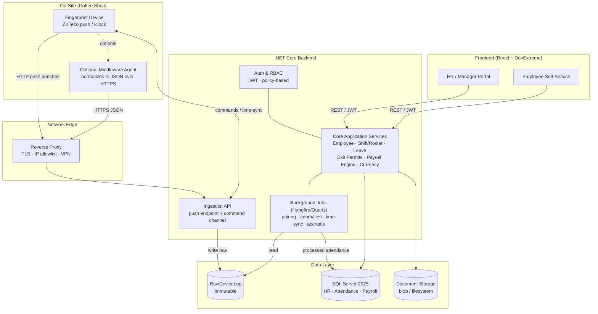
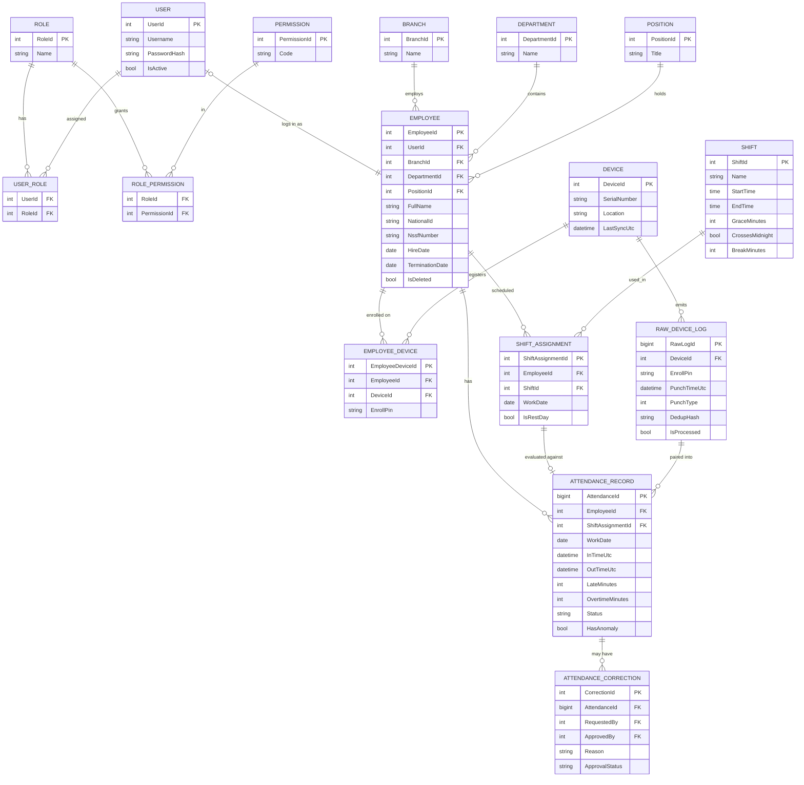
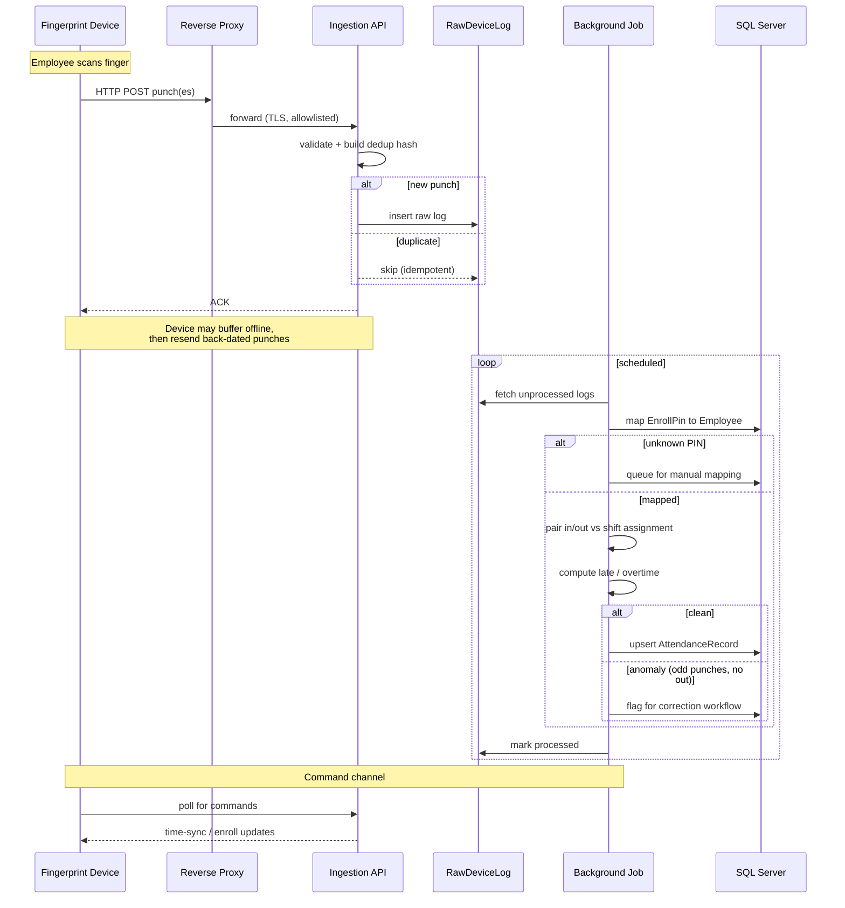
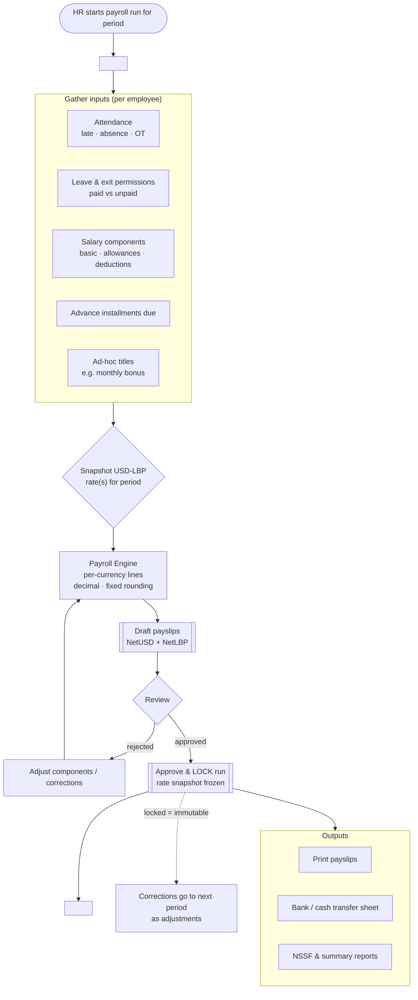

# Payroll & Attendance System — Design Diagrams

Target stack: **SQL Server 2025 · .NET Core APIs · React + DevExtreme**
Context: single coffee shop (branch-aware), dual currency **USD/LBP**, fingerprint device **HTTP push**.

These diagrams are the blueprint for Phase 1–3. They are intentionally not exhaustive on every column — they fix the *shape* of the system (entities, boundaries, and the tricky data flows) so implementation has a stable target.

---

## 1. System Architecture

The key boundary: the **device's contract is messy and untrusted**, so it is isolated behind a proxy and an immutable raw-log table. Everything domain-related happens *after* ingestion, in a separate processing layer.

---

## 2. ERD — Identity, Employee Master, Devices & Attendance

Note the deliberate split: `RAW_DEVICE_LOG` is write-once; `ATTENDANCE_RECORD` is the *processed* result that pairs punches against a `SHIFT_ASSIGNMENT` (the roster). Corrections never edit raw data — they flow through an approval workflow.

---

## 3. ERD — Leave, Payroll, Currency, Documents & Audit

`EMPLOYEE` appears here as a linking entity (its full definition is in diagram 2). The two non-negotiables in this half: every money row carries a **CurrencyCode**, and every `PAYROLL_RUN` freezes its **rate snapshot** so a locked period never recomputes.

```mermaid
erDiagram
    EMPLOYEE ||--o{ LEAVE_BALANCE : holds
    LEAVE_TYPE ||--o{ LEAVE_BALANCE : "tracked per"
    EMPLOYEE ||--o{ LEAVE_REQUEST : submits
    LEAVE_TYPE ||--o{ LEAVE_REQUEST : "of type"
    EMPLOYEE ||--o{ EXIT_PERMISSION : requests

    EMPLOYEE ||--o{ SALARY_COMPONENT : "structured with"
    COMPONENT_TYPE ||--o{ SALARY_COMPONENT : classifies
    CURRENCY ||--o{ SALARY_COMPONENT : "denominated in"

    EMPLOYEE ||--o{ ADVANCE : takes
    ADVANCE ||--o{ ADVANCE_INSTALLMENT : "repaid via"

    PAYROLL_PERIOD ||--o{ PAYROLL_RUN : "run for"
    PAYROLL_RUN ||--o{ PAYSLIP : produces
    EMPLOYEE ||--o{ PAYSLIP : "issued to"
    PAYSLIP ||--o{ PAYSLIP_LINE : "broken into"
    COMPONENT_TYPE ||--o{ PAYSLIP_LINE : categorizes
    CURRENCY ||--o{ PAYSLIP_LINE : "valued in"

    CURRENCY ||--o{ EXCHANGE_RATE : "from"
    CURRENCY ||--o{ EXCHANGE_RATE : "to"
    PAYROLL_RUN ||--o{ PAYROLL_RATE_SNAPSHOT : freezes
    EXCHANGE_RATE ||--o{ PAYROLL_RATE_SNAPSHOT : "captured as"

    EMPLOYEE ||--o{ DOCUMENT : "attached to"
    EMPLOYEE ||--o{ AUDIT_LOG : "changes tracked"

    EMPLOYEE {
        int EmployeeId PK
        string FullName
    }
    LEAVE_TYPE {
        int LeaveTypeId PK
        string Name
        bool IsPaid
        decimal AccrualPerMonth
        bool CarryOver
    }
    LEAVE_BALANCE {
        int LeaveBalanceId PK
        int EmployeeId FK
        int LeaveTypeId FK
        string PeriodYearMonth
        decimal Accrued
        decimal Used
        decimal Remaining
    }
    LEAVE_REQUEST {
        int LeaveRequestId PK
        int EmployeeId FK
        int LeaveTypeId FK
        date FromDate
        date ToDate
        decimal Days
        string ApprovalStatus
        int ApprovedBy FK
    }
    EXIT_PERMISSION {
        int ExitPermissionId PK
        int EmployeeId FK
        date PermitDate
        time FromTime
        time ToTime
        decimal Hours
        bool ConvertToLeave
        string ApprovalStatus
        int ApprovedBy FK
    }
    COMPONENT_TYPE {
        int ComponentTypeId PK
        string Name
        string Category
        int Sign
    }
    CURRENCY {
        string CurrencyCode PK
        string Name
        int DecimalPlaces
    }
    SALARY_COMPONENT {
        int SalaryComponentId PK
        int EmployeeId FK
        int ComponentTypeId FK
        decimal Amount
        string CurrencyCode FK
        date EffectiveFrom
        date EffectiveTo
    }
    ADVANCE {
        int AdvanceId PK
        int EmployeeId FK
        decimal Amount
        string CurrencyCode FK
        date IssuedOn
        int Installments
        string Status
    }
    ADVANCE_INSTALLMENT {
        int InstallmentId PK
        int AdvanceId FK
        string PeriodYearMonth
        decimal Amount
        bool IsDeducted
    }
    PAYROLL_PERIOD {
        int PayrollPeriodId PK
        string YearMonth
        date StartDate
        date EndDate
        bool IsClosed
    }
    PAYROLL_RUN {
        int PayrollRunId PK
        int PayrollPeriodId FK
        string Status
        datetime LockedAtUtc
        int ApprovedBy FK
    }
    PAYSLIP {
        int PayslipId PK
        int PayrollRunId FK
        int EmployeeId FK
        decimal NetUsd
        decimal NetLbp
    }
    PAYSLIP_LINE {
        int PayslipLineId PK
        int PayslipId FK
        int ComponentTypeId FK
        string Description
        decimal Amount
        string CurrencyCode FK
    }
    EXCHANGE_RATE {
        int ExchangeRateId PK
        string FromCurrency FK
        string ToCurrency FK
        string RateType
        date EffectiveDate
        decimal Rate
    }
    PAYROLL_RATE_SNAPSHOT {
        int SnapshotId PK
        int PayrollRunId FK
        int ExchangeRateId FK
        decimal Rate
        string RateType
    }
    DOCUMENT {
        int DocumentId PK
        int EmployeeId FK
        string FileName
        string StoragePath
        string ContentType
        long SizeBytes
        datetime UploadedUtc
    }
    AUDIT_LOG {
        bigint AuditId PK
        string EntityName
        string EntityKey
        string Action
        string OldValue
        string NewValue
        int ChangedBy FK
        datetime ChangedUtc
    }
```

---

## 4. Punch Ingestion — Sequence

Covers the three realities of HTTP-push devices: **idempotency** (resends), **offline buffering** (back-dated punches), and the **command channel** (time-sync to prevent clock drift). Pairing and anomaly handling are async, never inline with ingestion.

---

## 5. Payroll Run — Flow & Lifecycle

A run gathers all inputs per employee, **snapshots the exchange rate**, computes per-currency lines, then moves through draft → review → approved → **locked**. Once locked it is immutable; later fixes become adjustments in the *next* period.

---

## How these map to the build phases

- **Phase 1 (MVP):** Diagrams 1, 2, 4 — RBAC, employee master, shifts/roster, ingestion, pairing, late/absence.
- **Phase 2:** Leave + exit-permission entities from diagram 3, with approval workflows.
- **Phase 3:** Payroll/currency entities from diagram 3 and the full flow in diagram 5.
- **Phase 4:** Self-service portal, dashboards, documents, notifications.

Two things still to confirm before schema implementation (they only affect detail, not shape): the **exact device model/firmware** (sets the real ingestion payload), and the **NSSF/official-rate treatment** with your accountant (regulatory, not a design choice I should make).
